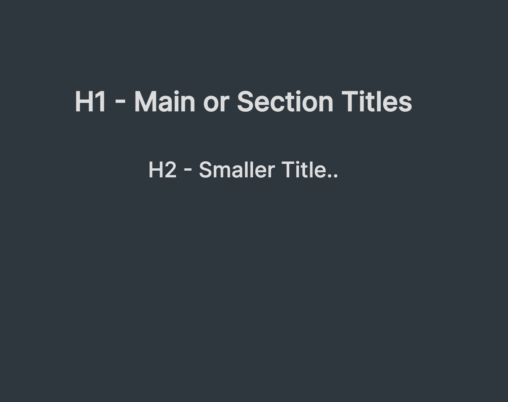
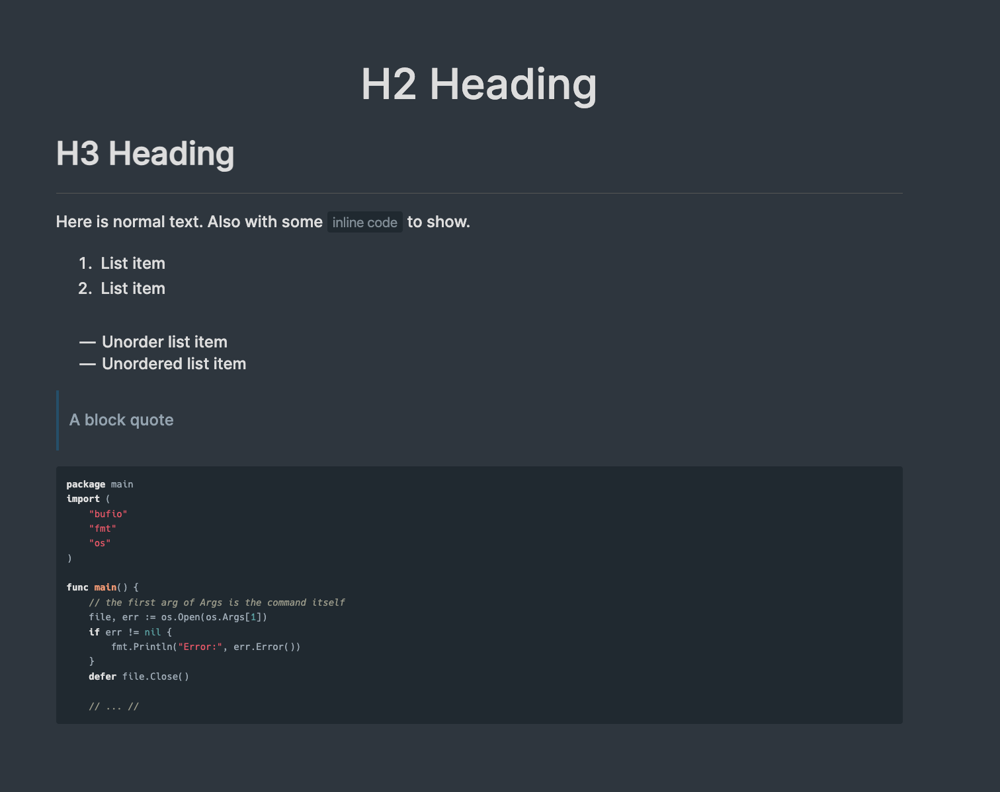

# cleaver-reflex

A theme for jdan's [cleaver markdown presentation tool](https://github.com/jdan/cleaver).

To use, include `tjex/cleaver-reflex` in the `theme:` field of your markdown presentation doc.

```text
title: Theme Example
output: theme.html
theme: tjex/cleaver-reflex
```

or simply clone down the repo and put a local path in the `theme:` field.

```text
title: Theme Example
output: theme.html
theme: ~/presentations/foo-2023/cleaver-reflex.css
```

See [here](https://github.com/jdan/cleaver/wiki/Theme-Index) for further info and alternate import options.

## Preview




